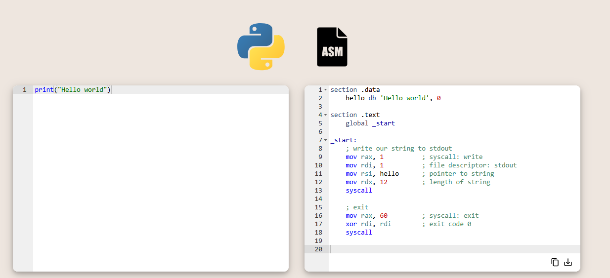

# 📚 Learning Python 🐍
Hola, soy el Seba. Me dedico a la informatica y me encanta enseñar. Por lo que, durante mis años estudiando ingenería en infomática, me ví en la necesidad de centralizar todos los tips, materiales y apuntes acerca de la programación en un solo lugar. Es por eso que decidí crear este repositorio, para compartir con ustedes todo lo que he aprendido y seguir aprendiendo juntos.

## 📝 Contenidos
- [📚 Learning Python 🐍](#-learning-python-)
  - [📝 Contenidos](#-contenidos)
  - [📦 Introducción](#-introducción)
  - [Contenidos del curso](#contenidos-del-curso)
  - [쯈ué es programar?](#qué-es-programar)
  - [쯇or qué aprender Python?](#por-qué-aprender-python)
  - [쮸 quién va dirigido este curso?](#a-quién-va-dirigido-este-curso)
  - [📚 Recursos complementarios](#-recursos-complementarios)

## 📦 Introducción
Les quiero dar la bienvenida a "Learning Python", en el cual estaré subiendo contenido útil para comprender cómo funciona Python.

En este repositorio encontrarás:
- 📚 Material para introducirte en la programación y sus conceptos claves.
- 📝 Ejercicios para practicar.
- 📦 Proyectos para aplicar lo aprendido.
- 📖 Documentación de Python (Con referencias a la documentación oficial).
- 📌 Y mucho más...

## Contenidos del curso
Cómo primer paso para empezar a utilizar Python, debemos de introducirnos a los conceptos del mundo de la programación. Para comprender mejor el porqué de las cosas, vamos a conocer las filososfías y conceptos claves que nos permitirán desarrolar mejor nuestras capacidades cómo desarrolladores.

Primero, vamos darle un vistazo al pensamiento computacional y cómo este nos ayuda a resolver problemas de manera eficiente.

Luego, vamos a ver cómo podemos representar graficamente el concepto de algoritmo y cómo este nos ayuda a resolver problemas.

Posteriormente, habrán ejercicios que pondrán a prueba nuestras habilidades para pensar lógicamente y solventar problemas de manera eficiente.

Finalmente, vamos a ver cómo podemos aplicar estos conceptos en PSEINT y cómo utilizar pseudocódigo nos permite automatizar tareas e insertarnos en el mundo de la programación.

## 쯈ué es programar?
Programar es el proceso de crear instrucciones que le indican a una computadora qué hacer. Estas instrucciones se escriben en lenguajes de programación y permiten automatizar tareas, resolver problemas y desarrollar aplicaciones. En palabras de la Real Academia Española, programar es "elaborar programas para su empleo en computadoras".

Por ejemplo, al programar, puedes indicarle a una computadora que realice cálculos, procese datos o controle dispositivos electrónicos. Es una habilidad fundamental en la era digital, ya que permite crear soluciones tecnológicas en diversos ámbitos.

## 쯇or qué aprender Python?
Python es uno de los lenguajes de programación más populares y versátiles en la actualidad. Su sintaxis clara y sencilla lo hace ideal para principiantes. Además, Python se utiliza en múltiples áreas, como desarrollo web, análisis de datos, inteligencia artificial y automatización de tareas.

> "Python es un lenguaje de programación interpretado, de alto nivel y de propósito general. Su diseño enfatiza la legibilidad del código y su sintaxis permite a los programadores expresar conceptos en menos líneas de código que otros lenguajes." - [Wikipedia](https://es.wikipedia.org/wiki/Python_(lenguaje_de_programaci%C3%B3n))

Aprender Python te brinda la oportunidad de:
* Desarrollar aplicaciones de forma rápida y eficiente.
* Automatizar tareas repetitivas y mejorar la productividad.
* Acceder a una amplia comunidad de desarrolladores y recursos en línea.
* Incrementar tus oportunidades laborales en el sector tecnológico.

Según el informe Octoverse 2024 de GitHub, Python es el lenguaje de programación más utilizado a nivel mundial.

## 쮸 quién va dirigido este curso?
Este curso está diseñado para personas sin experiencia previa en programación o informática. Si alguna vez te has preguntado cómo funcionan las aplicaciones, cómo automatizar tareas o cómo crear tus propios programas, este curso es para ti.

No necesitas conocimientos técnicos avanzados; solo se requiere curiosidad y ganas de aprender. A través de explicaciones claras y ejemplos prácticos, te guiaremos paso a paso en tu camino para convertirte en programador/a.

## 📚 Recursos complementarios
Para profundizar en los temas tratados, te recomendamos los siguientes recursos:

**Libros:** Python Crash Course, 3rd Edition: A Hands-on, Project-based Introduction to Programming, Think Python, Python para informáticos

**Cursos en línea:** Introducción a la programación en Python I: Aprendiendo a programar con Python, Curso: Introducción a la programación con Python

Estos recursos te ofrecerán una comprensión más profunda y práctica de la programación en Python.

 

